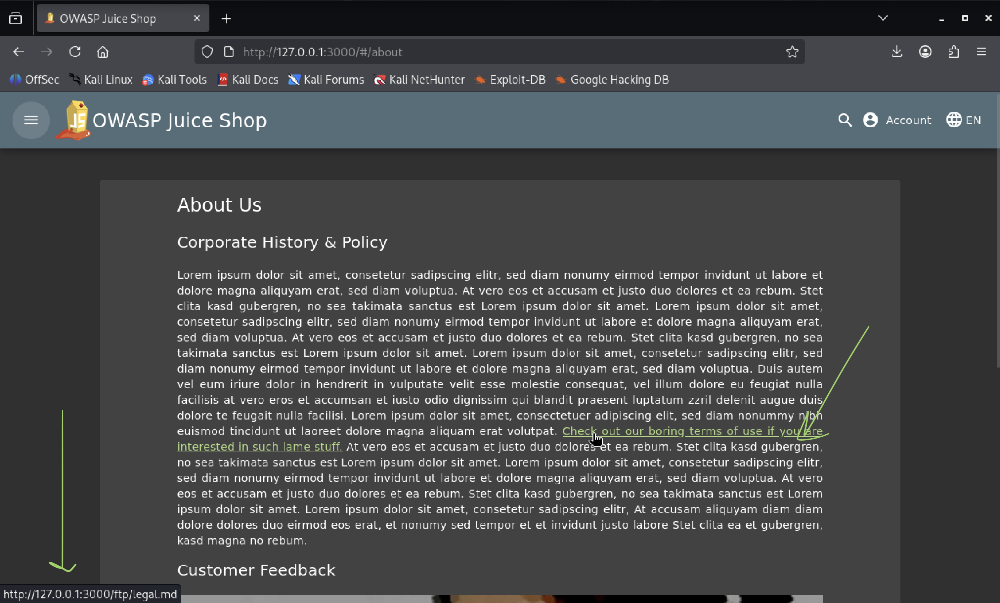
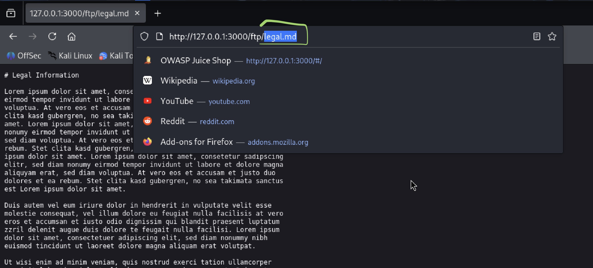
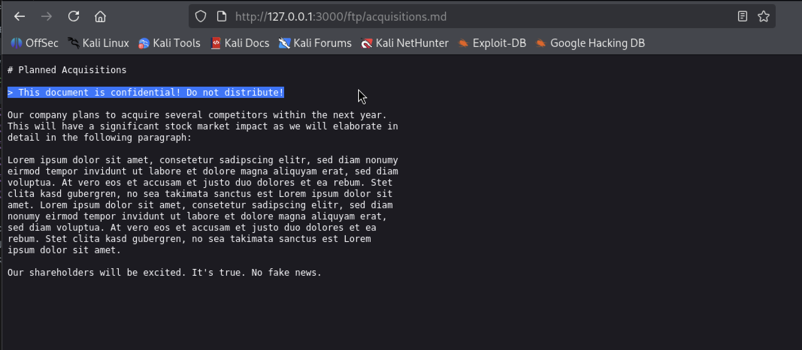

# Find Restricted Document

## Challenge Description

The objective of this challenge is to locate a restricted document within the OWASP Juice Shop application by analyzing publicly accessible links and manually manipulating URLs using a web browser.

## Disclaimer

This challenge was solved in a controlled lab environment and is documented strictly for educational purposes.
The OWASP Juice Shop application must be started locally before performing this challenge (see Quickstart section of the main repository).  

The interaction is performed entirely through a web browser

The application can be started using

```bash
npm start
```
---

## Table of Contents

- [Disclaimer](#disclaimer)
- [Usage](#usage)
- [Recording of the Challenge](#recording-of-the-challenge)
- [Vulnerability Category](#vulnerability-category)
- [Tools Used](#tools-used)
- [Step-by-Step Solution](#step-by-step-solution)
- [Result](#result)
- [Security Impact](#security-impact)
- [Mitigation](#mitigation)


---

## Usage

1. Start the OWASP Juice Shop application locally.
2. Open a web browser.
3. Navigate to `http://127.0.0.1:3000`.
4. Ensure the application is running and accessible.
5. Follow the steps described in the **Step-by-Step Solution** section to reproduce the challenge.

---

## Recording of the Challenge

https://go.screenpal.com/watch/cOVDXanrKV3

---

## Vulnerability Category

Broken Access Control / Directory Listing

This challenge has a difficulty rating of 1 star (1/6)

---

## Tools Used

- Kali Linux
- Mozilla Firefox

---

## Step-by-Step Solution

1. Start the OWASP Juice Shop application locally

   

2. Navigate to the **About Us** page via the sidebar menu, or by manually appending `/about` to the base URL

   

3. While reviewing the content of the **About Us** page, a link to the document `/ftp/legal.md` was identified.  
The presence of this link suggested that the application exposes files from an internal `/ftp/` directory via the web server

   

4. Manually modify the URL in the browser’s address bar by removing the file name `legal.md`

   

5. Access the `/ftp/` directory directly to check whether directory listing is enabled. Browse through the available folders and files to identify accessible resources

   

6. Based on the assumption that sensitive documents are often stored as text files, the application was analyzed to identify pages that reference textual content.

   The **About Us** section appeared to be a likely candidate, as it commonly contains legal or informational documents.  
   Within this section, a link to the file `/ftp/legal.md` was identified.

   The URL structure indicated that the file was served from an `/ftp/` directory, suggesting that additional files might be accessible.  
   By manually navigating to the `/ftp/` directory, directory listing was confirmed to be enabled.

   During this process, the file `acquisitions.md` was discovered and opened.  
   This document represents a restricted internal resource, which should not be publicly accessible without authentication or authorization

   

---

## Result

The application allowed unrestricted access to internal files and directories without authentication or authorization checks.  
By manually modifying URLs, it was possible to browse the internal `/ftp/` directory and access sensitive documents that were not intended for public exposure


---

## Security Impact

Due to missing access control mechanisms, unauthorized users are able to freely browse internal directories and access sensitive files exposed via the web server.

In a real-world scenario, this vulnerability could lead to the disclosure of:
- internal legal documents (e.g. contracts, acquisition plans, compliance reports),
- configuration or backup files containing credentials or system information,
- internal business data not intended for public access.

In the worst-case scenario, an attacker could:
- gather sensitive information to support further targeted attacks,
- exploit leaked credentials to gain deeper access to internal systems,
- cause violations of data protection regulations such as GDPR,
- expose the organization to legal consequences, financial penalties, and reputational damage.

From a business perspective, such a vulnerability represents a critical risk, as it enables unauthorized access to internal resources without any technical barrier.

Such findings would typically be classified as high severity in a penetration testing report due to the potential business and compliance impact


---

## Mitigation

- Prevent public directory exposure via the web server  
  Disable directory listing and ensure that internal directories (e.g. `/ftp/`) are not mapped to publicly accessible web paths.  
  Sensitive files should be stored outside the web root and accessed only through controlled application logic.

- Implement proper access control and authorization checks  
  Access to sensitive resources must be validated on the server side, ensuring that only authenticated and authorized users can access protected files and endpoints.  
  A clear role-based access control (RBAC) model should be applied to define which users are permitted to access specific resources.

- Apply network-level security controls  
  Firewalls, reverse proxies, or network segmentation can be used to restrict access to internal services and limit traffic to trusted networks only.  
  This provides an additional layer of protection in case of application-level misconfigurations.

- Follow the principle of least privilege  
  Applications and services should operate with the minimum permissions required, reducing the potential impact of unauthorized access.
